### Use a programmable MacroPad to avoid being fired!

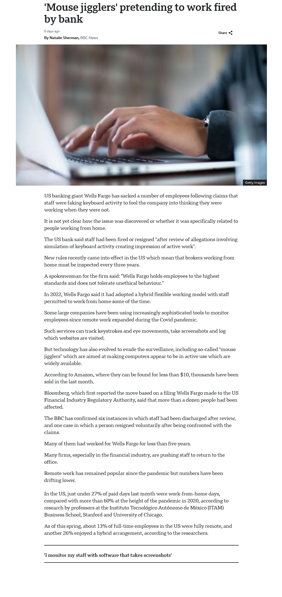 *US banking giant Wells Fargo has sacked a number of employees following claims that staff were faking keyboard activity to fool the company into thinking they were working at home when they were not.*
[**As reported here 14 June 2024.**](https://www.bbc.com/news/articles/cjll01220yeo)

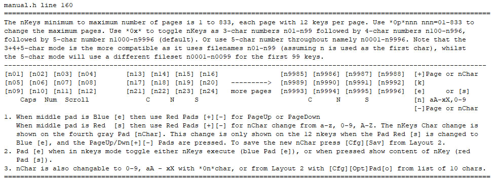 Use a [**TouchLCDMacropad with more than one million macros - which can be even further expanded through linked macro-lists**](https://github.com/TobiasVanDyk/Pico-MCU-from-Raspberry-Pi/tree/main/TouchMacroPadPico) - to simulate (almost) any type of PC-based work, and being a trusted hardware device, also bypass detection algorithms for software-based-automation-tools such as [**AutoIt**](https://www.autoitscript.com/site/) and [**Power-Automate**](https://www.microsoft.com/en-us/power-platform/products/power-automate). A PC Windows-based configuration tool for the Pico Touch LCD is also available.

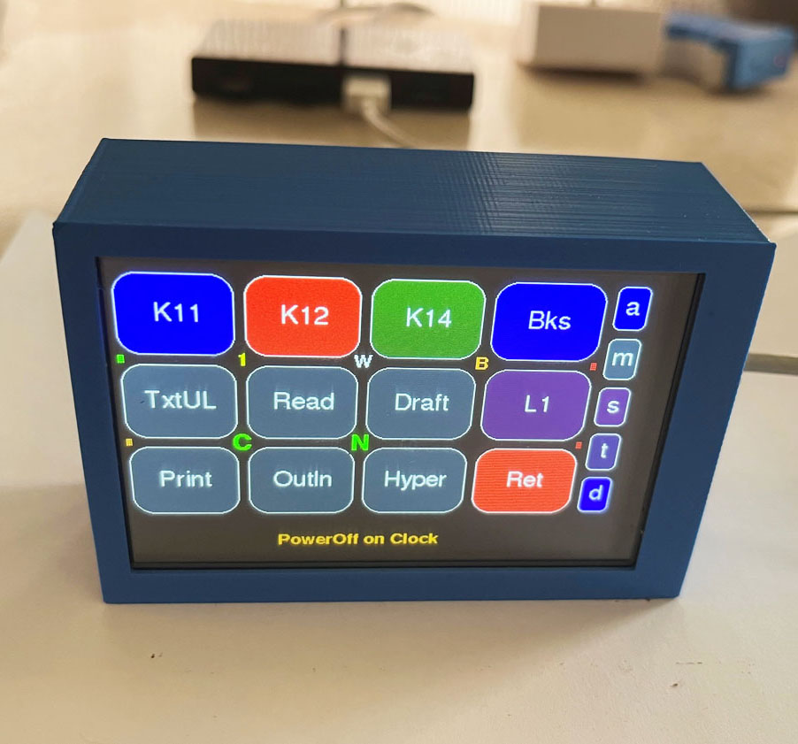
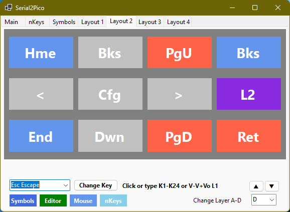
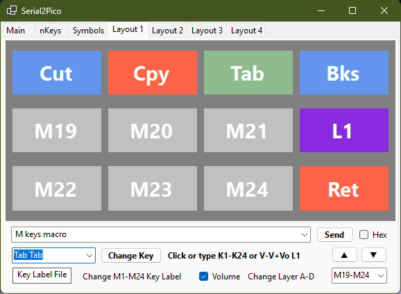  
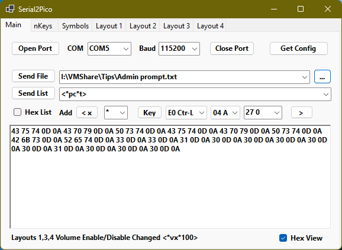
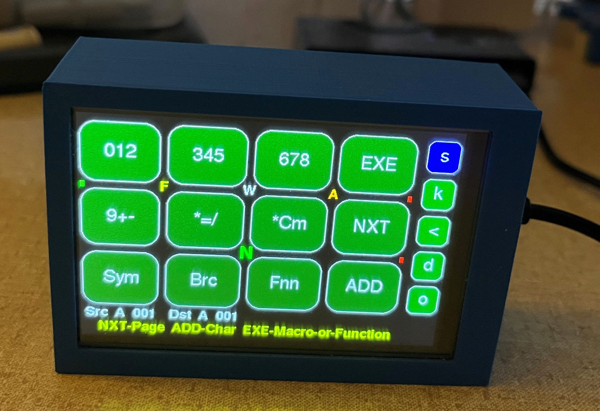
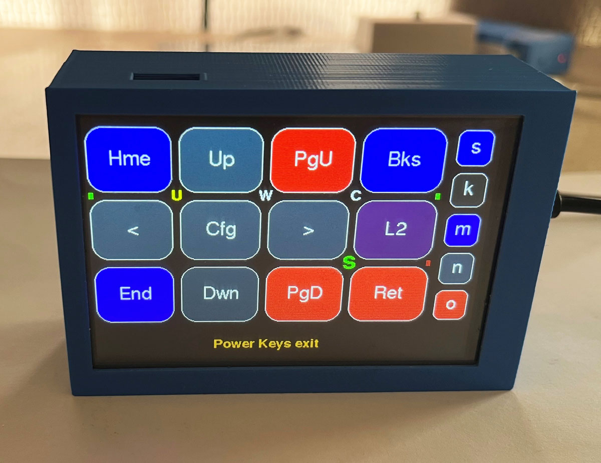
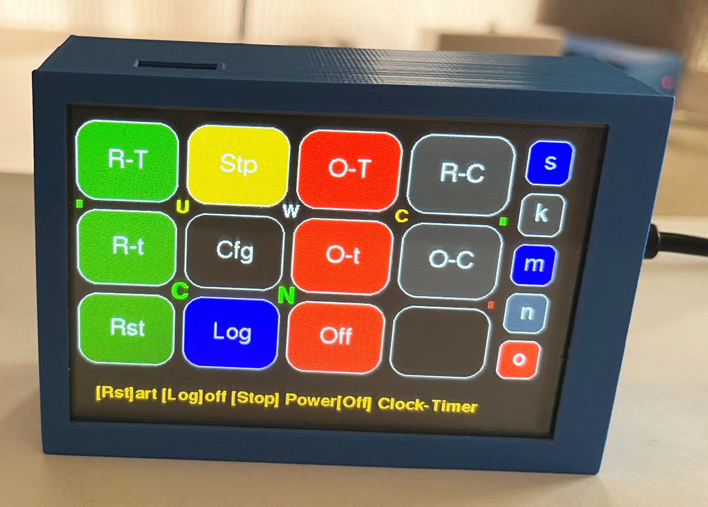
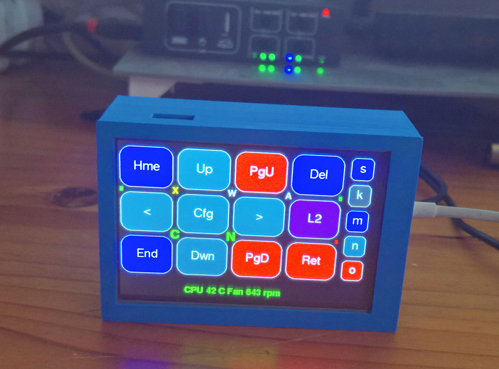
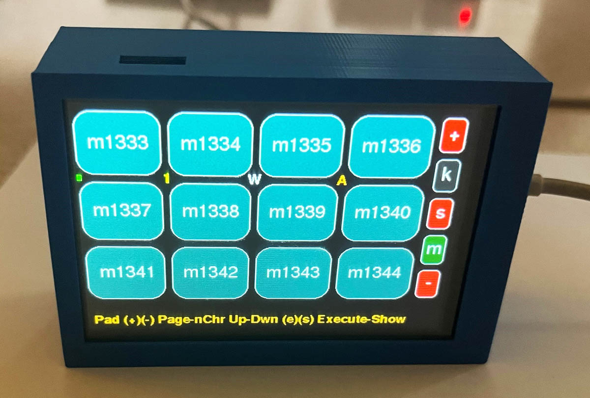
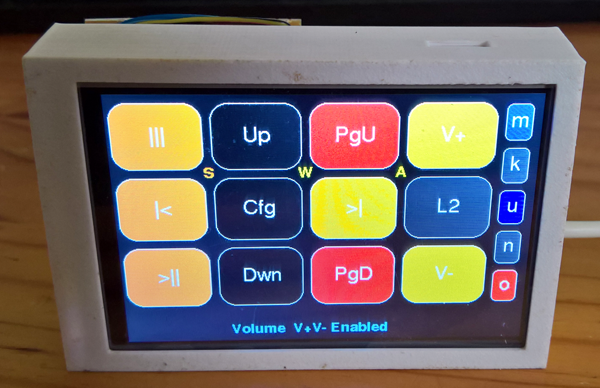
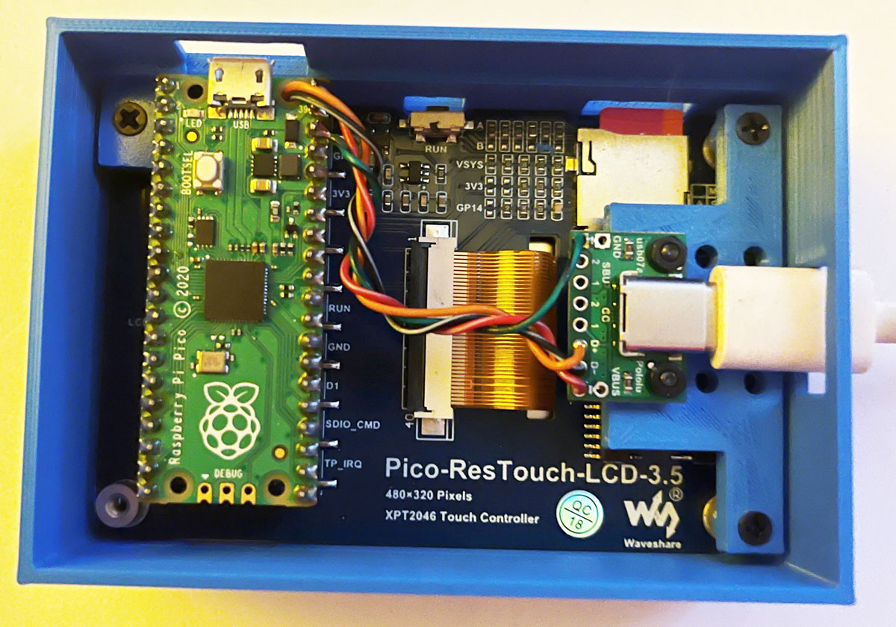  

Also works with, or use, all of the **non-banned**  and [**banned**](https://github.com/TobiasVanDyk/TobiasVanDyk/blob/main/images/pi-banned.jpg), major product-lines from [**Raspberry Pi Holdings PLC RPI**](https://www.londonstockexchange.com/stock/RPI/raspberry-pi-holdings-plc/company-page), [**Raspberry Pi**](https://www.raspberrypi.com/) and [**Raspberry Pi Foundation**](https://www.raspberrypi.org/).

