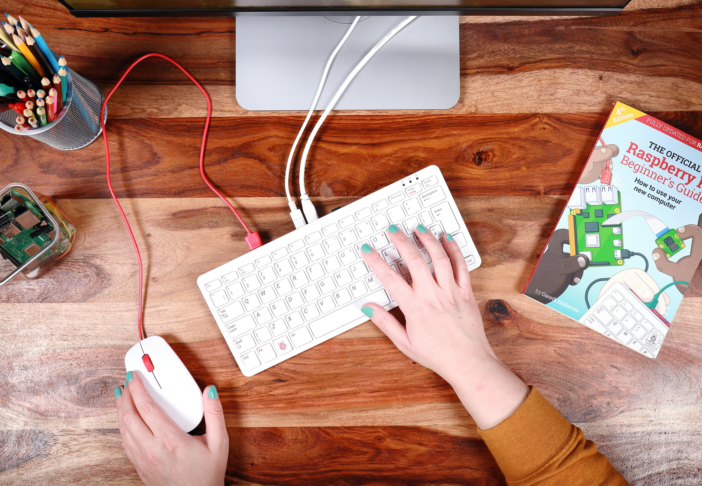
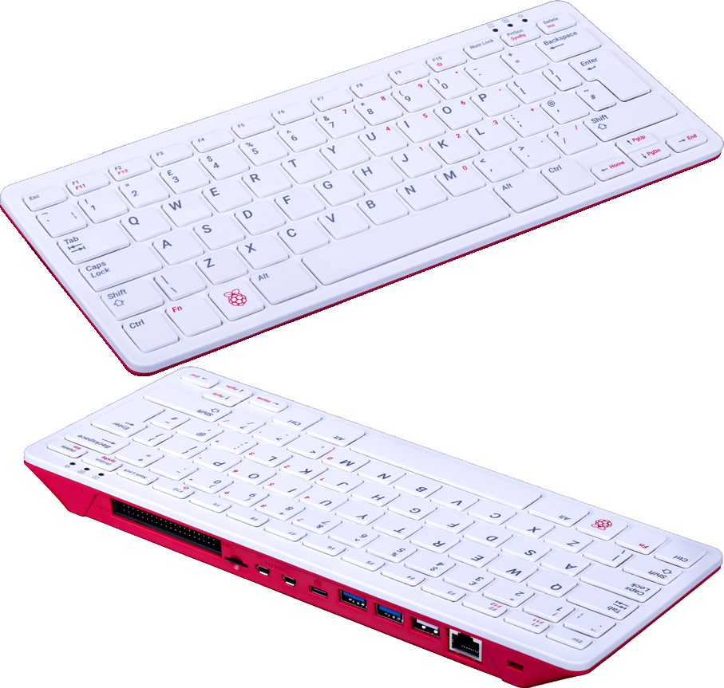

### The Raspberry Pi 400 is the Best Computer Product of this Century 
*If you have read about it and are thinking of buying it do not wait - just buy it!* 

  

 Read some of the magnanimous multitude of reviews and teardowns available on the internet such as [**Wired UK - The Raspberry Pi 400 reinvents the microcomputer for 2020**](https://www.wired.co.uk/article/raspberry-pi-400-review), [**Jeff Geerling's Review**](https://www.jeffgeerling.com/blog/2020/raspberry-pi-400-teardown-and-review), [**The Verge Review**](https://www.theverge.com/2020/11/2/21542278/raspberry-pi-400-keyboard-computer-arm-release-date-news-features), and [**Elektor's An In-Depth Look at the Raspberry Pi 400**](https://www.elektormagazine.com/news/raspberry-pi-400-review).

   Also [**visit the official Raspberry Pi Home Page for the RPi400**](https://www.raspberrypi.org/products/raspberry-pi-400/) or the [**RPi400 MagPi Magazine Issue 101**](https://magpi.raspberrypi.org/issues/101).  

