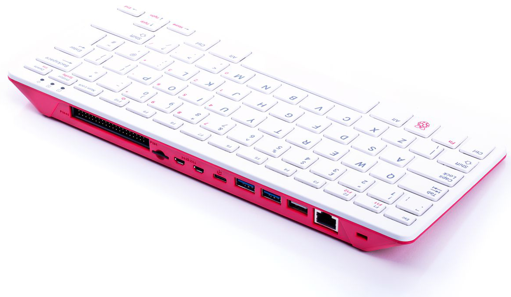
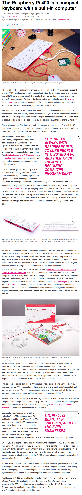
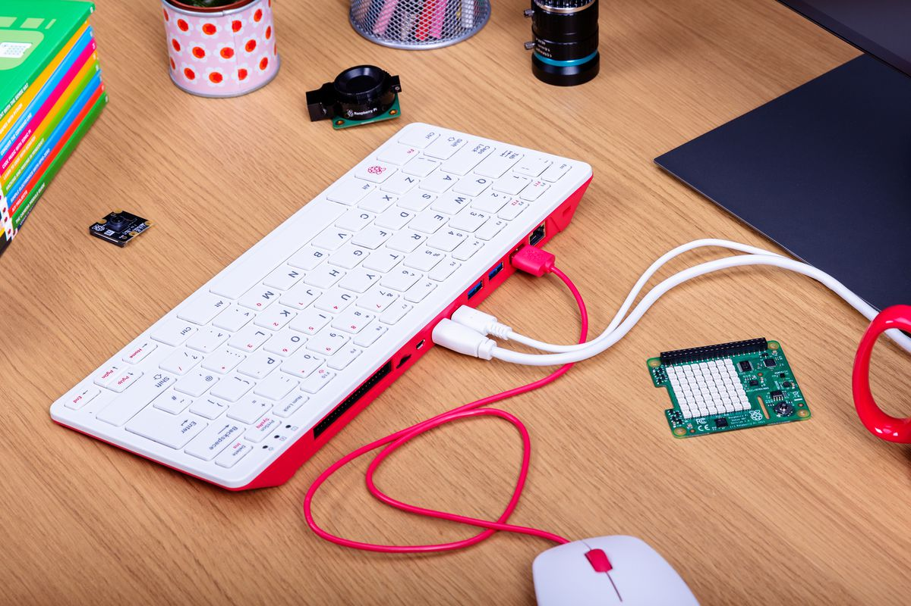
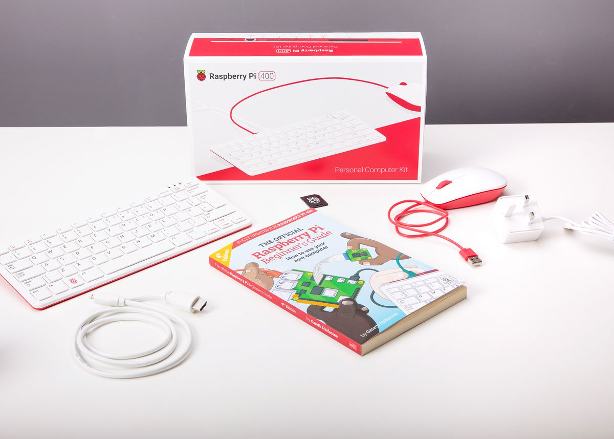

### The Best Computer Product of the Century is the Raspberry Pi 400

*I you have read about it and are thinking of buying it do not wait - just buy it!* 

 
Read some of the reviews and teardowns available on the internet such as [**Jeff Geerling**](https://www.jeffgeerling.com/blog/2020/raspberry-pi-400-teardown-and-review) and [**The Verge**](https://www.theverge.com/2020/11/2/21542278/raspberry-pi-400-keyboard-computer-arm-release-date-news-features)   

Visit the [**official Raspberry Pi Home Page for the RPi400**](https://www.raspberrypi.org/products/raspberry-pi-400/).      

