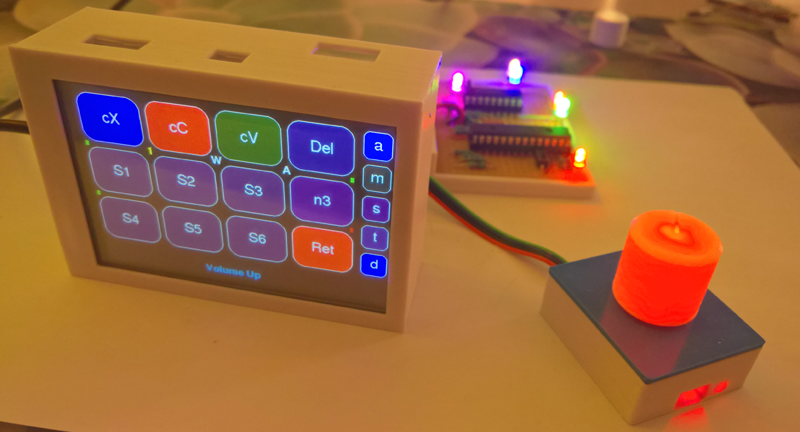
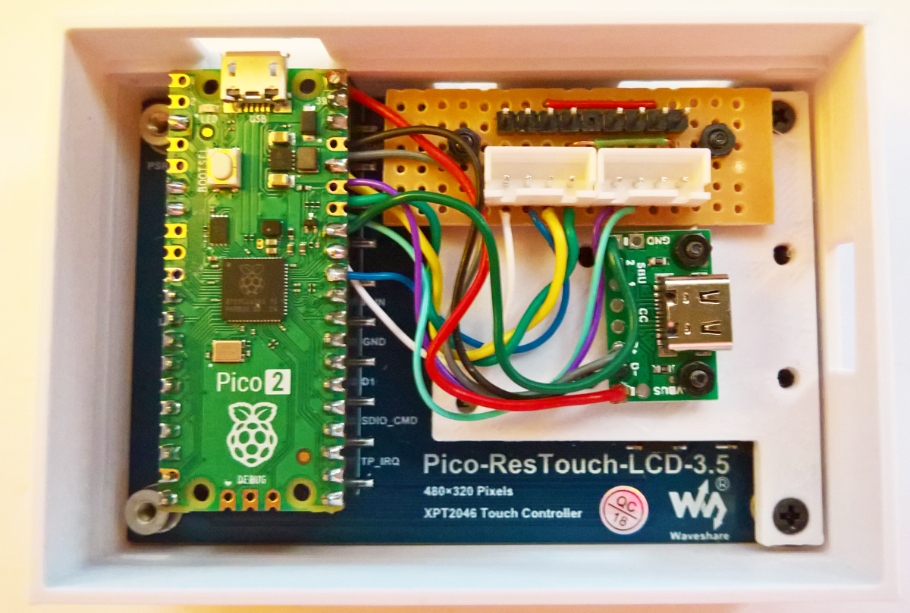

### Use a programmable MacroPad to avoid being fired!

 *US banking giant Wells Fargo has sacked a number of employees following claims that staff were faking keyboard activity to fool the company into thinking they were working at home when they were not.*
[**As reported here 14 June 2024.**](https://www.bbc.com/news/articles/cjll01220yeo)

 Use a file-and-folder-based [**TouchLCDMacropad with more than one million macros - which can be even further expanded through linked macro-lists**](https://github.com/TobiasVanDyk/Pico-MCU-from-Raspberry-Pi/tree/main/TouchMacroPadPico) - to simulate (almost) any type of PC-based work, and being a trusted hardware device, also bypass detection algorithms for software-based-automation-tools such as [**AutoIt**](https://www.autoitscript.com/site/) and [**Power-Automate**](https://www.microsoft.com/en-us/power-platform/products/power-automate). A Visual Studio C# mimic of the Touch macropad, with additional [**configuration**](https://github.com/TobiasVanDyk/RPi-Pico1-Pico2-Applications/blob/main/TouchMacroPadPico/Serial2PicoApp/Exercise2.pdf) and [**control functions**](https://github.com/TobiasVanDyk/RPi-Pico1-Pico2-Applications/blob/main/TouchMacroPadPico/Serial2PicoApp/Exercise1.pdf), is also in [**development**](https://github.com/TobiasVanDyk/RPi-Pico1-Pico2-Applications/tree/main/TouchMacroPadPico/Serial2PicoApp), as shown below in images 2 through 6. The PC application showcases the Pico MacroPad’s [**nKeys multiple indirection capability**](https://github.com/TobiasVanDyk/RPi-Pico1-Pico2-Applications/blob/main/TouchMacroPadPico/Serial2PicoApp/Five-Macro-Types-with-Label-Changes.pdf) via its automatic application-switching control. A wide range of plug-in modules will be added in the future, and the first three of these, namely a macropad and PC App set of functions to control and configure CircuitPython devices, multiple I²C RGB rotary encoders, and three types of Microchip I²C GPIO expanders, have been completed. The [**capacitive touch RP2350B LCD of choice**](https://www.waveshare.com/RP2350-Touch-LCD-3.5.htm) also has an ES8311 audio function that can play 16bit PCM files saved on the SDCard. [**This version with a case**](https://www.waveshare.com/rp2350-touch-lcd-3.5.htm?sku=33896) is suitable to use lying flat - provided no I²C peripherals are plugged into the expander at the back of the case.

  

  

  
    

  

Also works with, or use, all of the **non-banned**  and [**banned**](https://github.com/TobiasVanDyk/TobiasVanDyk/blob/main/images/pi-banned.jpg), major product-lines from [**Raspberry Pi Holdings PLC RPI**](https://www.londonstockexchange.com/stock/RPI/raspberry-pi-holdings-plc/company-page), [**Raspberry Pi**](https://www.raspberrypi.com/) and [**Raspberry Pi Foundation**](https://www.raspberrypi.org/).

