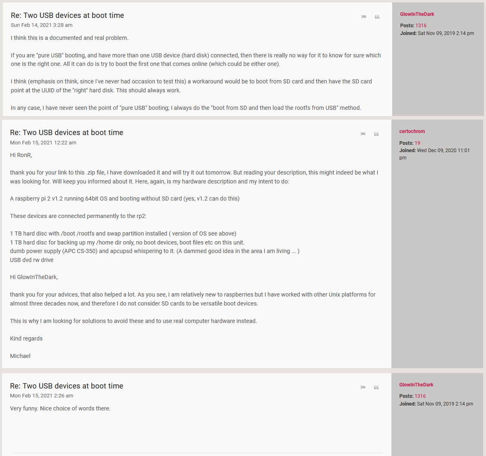
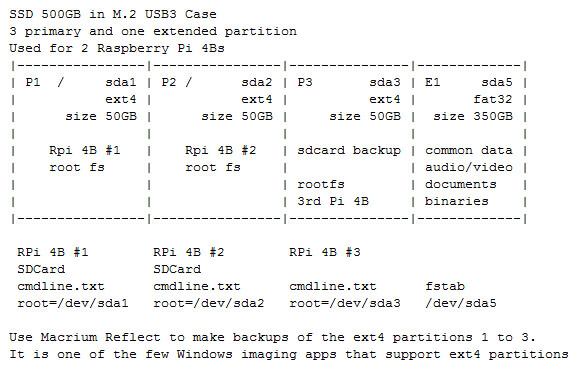
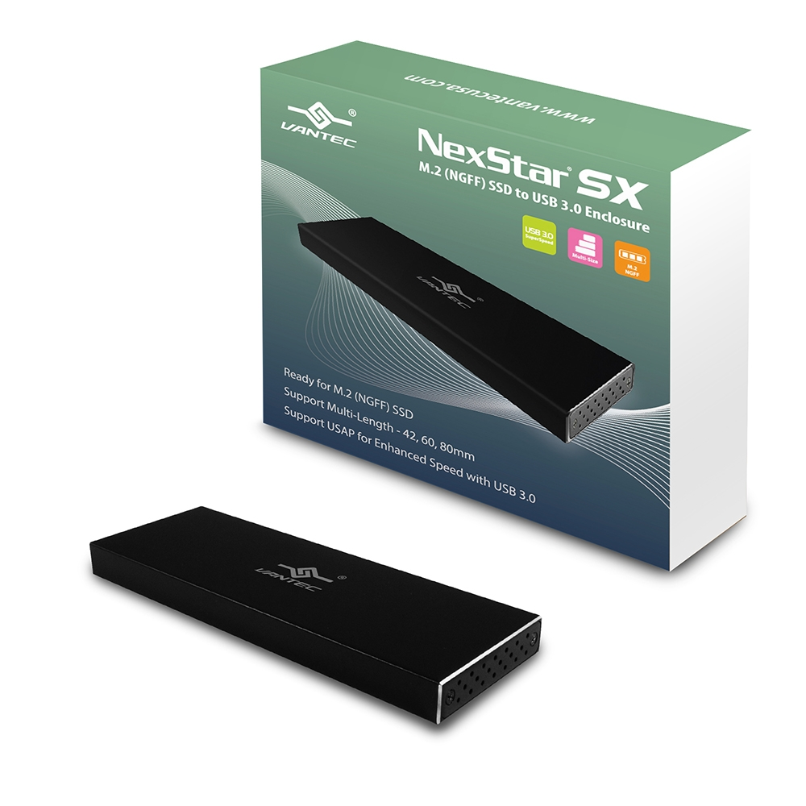

**Raspberry Pi 400:** To accommodate three other Raspberry Pi computers such as the Pi 400, whilst using only one 500GB SSD in an M.2 external enclosure (see note 1, I partitioned the 500GB SSD into four partitions - three 50GB primary partitions for the Raspberry Pi root file system, and the rest as a 350GB FAT32 partition which holds video and  audio files, binaries and various Raspberry Pi related documents. Doing it this way enables me to plug the SSD into another computer and then synchronize it with my music and video collection and Raspberry Pi documentation, from the other computer. For all three Raspberry Pi computers I [**still**](https://www.raspberrypi.org/forums/viewtopic.php?f=28&t=301409) use an  SDCard as the boot partition (see note 2), which  respectively boots /dev/sda1, /dev/sda2, and /dev/sda3. The three different Pi computers are a RPi 4B with an audio DAC (left picture below, and also see the last section [**here**](https://github.com/TobiasVanDyk/Raspberry-Pi-PC-PSU-Desktop-Computer-with-a-Hard-Disk-Drive-and-Fan-and-Switch)), a Raspberry Pi 400 (middle and right picture below), and another RPi used to test SPI LCD hats and programming the Pico. 

I can then plug the drive into a windows PC and 
1. Use Macrium Reflect Free to make backups of the ext4 partitions 1 to 3. It is one of the few free Windows imaging programs that support ext4 partitions.
2. Use the Windows Western Digital SSD Dashboard to run TRIM on the SSD
3. Use a synch program to update the data partition from the other PC.

  

 
  
 

**Note 1: Recommended M.2 SATA external enclosures**

The two M.2 SATA SSD to USB adapters that have been used with a Raspberry Pi 400 are as shown in the table below and in the two pictures left to right:

| Manufacturer | Chipset         | USB VID:PID | Cable Interface | Name and Link                                   |
|:-------------|:----------------|:------------|:----------------|:------------------------------------------------|
| Vantec       | ASMedia ASM1153 | 174c : 55aa | USB 3.0 Micro B | [NexStar SX NST-M2STS3-BK](https://www.vantecusa.com/products_detail.php?p_id=214) |
| Unitek       | VIA VL817       | 2109 : 0715 | USB C           | [Unitek M.2 SSD (NGFF/SATA) Aluminium Enclosure](https://www.unitek-products.com/products/usb3-0-m-2-ssd-ngff-sata-aluminium-enclosure) | 

 
   

The ASmedia ASM1153 and VIA VL817 - see [(a) ](https://spod.cx/blog/enabling_trim_support_via_VL817_usb_sata_adaptor.shtml)[(b) ](https://forum.odroid.com/viewtopic.php?t=31948)[(c)](https://usb-ids.gowdy.us/read/UD/2109/0715) both work at full USB 3 speed with UAS enabled. For more information see [Raspberry Pi 4 USB Boot Config Guide for SSD / Flash Drives](https://jamesachambers.com/raspberry-pi-4-usb-boot-config-guide-for-ssd-flash-drives/). Also refer to [this list of Raspberry Pi Forum posts](RaspberryPi-USB-SSD-Boot.txt) about USB SSD/HDD boot problems and solutions.

**Note 2:** Unixers are never true Linuxers, and they are obviously also not Windowers, but they do like the Bee-ess-dee-ers...

