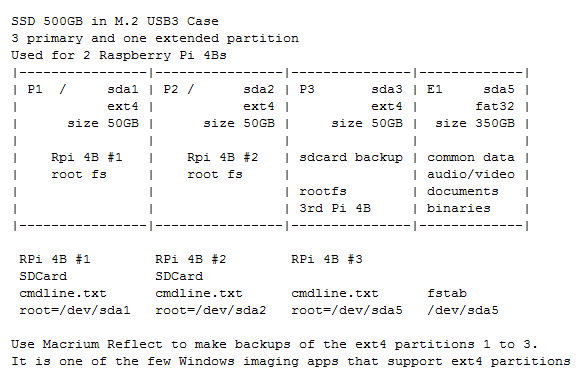
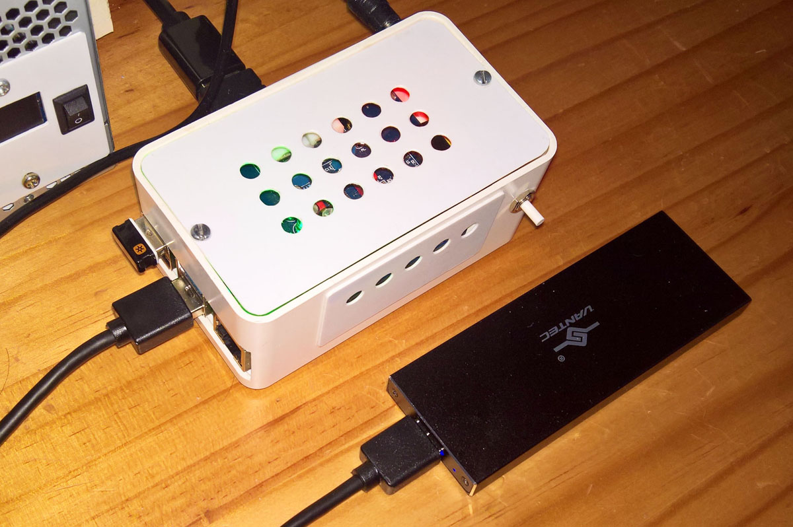
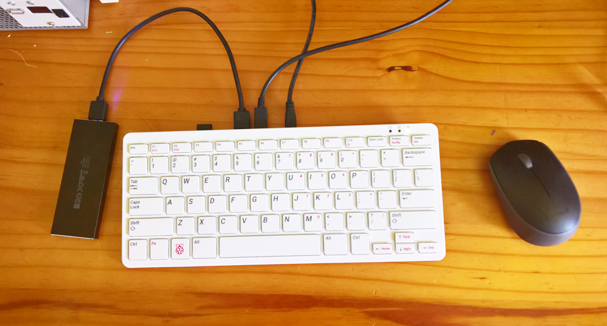

**Raspberry Pi 400:** To accommodate three other Raspberry Pi computers such as the Pi 400, whilst using only one 500GB SSD in an M.2 external enclosure, I partitioned the 500GB SSD into four partitions - three 50GB primary partitions for the raspberry pi root file system, and the rest as a 350GB FAT32 partition which holds video and the audio files and various Raspberry Pi related documents. Doing it this way enables me to plug the SSD into another computer and then synchronize it with my music and video collection and Raspberry Pi documentation, on the other computer. For all three Raspberry Pi computers I stll use an SDCard as the boot partition, and they respectively booot /dev/sda1, /dev/sda2, and /dev/sda3. The three different Pi computers are a RPi 4B with an audio DAC (left picture below, and also see the last section here), a Raspberry Pi 400 (middle and right picture below), and another RPi used to test SPI LCD hats and programming the Pico. 

I can then plug the drive into a windows PC and 
1. Use Macrium Reflect Free to make backups of the ext4 partitions 1 to 3. It is one of the few Windows imaging apps that support ext4 partitions.
2. Use the Windows WD SSD Dashboard to run TRIM on the SSD
3. Use a synch app to update the data partition from the Windows PC.

  

 
  
 

